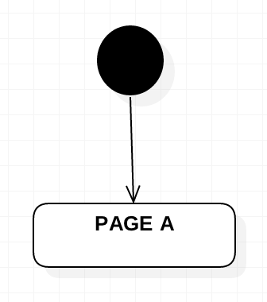
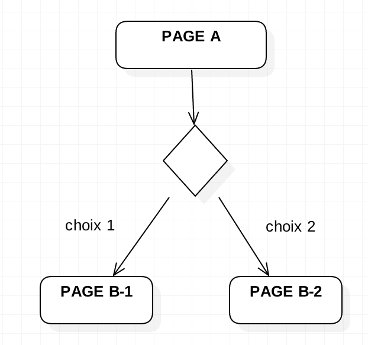
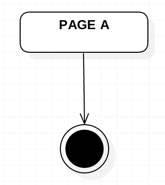
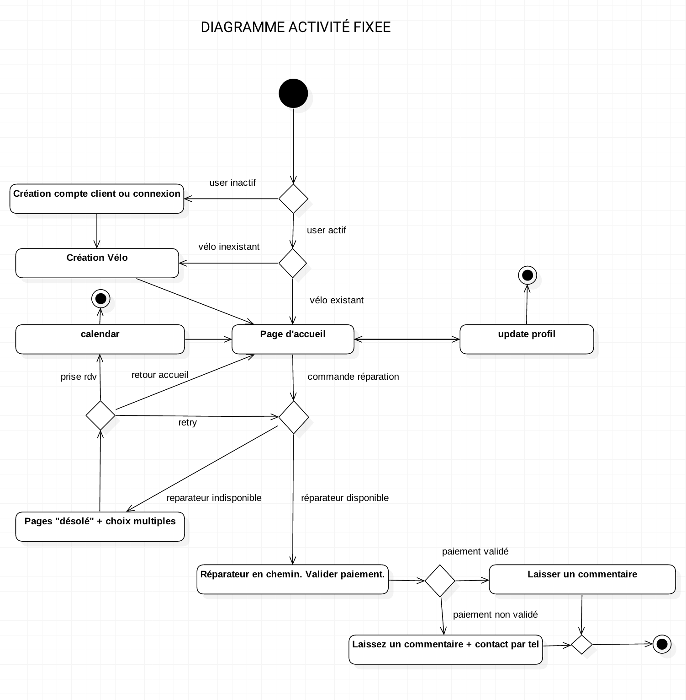

----------------------

#Diagramme d'Intéraction

Ce chapitre s'inscrit dans le module [Diagramme UML](https://github.com/simplonco/Diagrammes-UML).

1. [ ] [Diagramme Use-Case](https://github.com/simplonco/UML-Use-Case)
	
2. [ ] [Diagramme de séquence](https://github.com/simplonco/UML-Sequence)
	
3. [x] [Diagramme d'intéraction](https://github.com/simplonco/UML-Interaction)
	
4. [ ] [Diagramme de classe](https://github.com/simplonco/UML-Class)

Vous pouvez trouver ce module dans les parcours suivants :

+ Développeur Web Fullstack

-----------

Une fois qu'on a fait le diagramme [use case](https://github.com/simplonco/UML-Use-Case) et le diagramme de [séquence](https://github.com/simplonco/UML-Sequence), on va vouloir mieux définir les différentes intéractions de nos utilisateurs. On va donc créer une _diagramme d'interaction_ ( appelé aussi diagramme d'activité ) pour chaque type d'utilisateur de notre site.

Il contient tout les points d'entrée et sortie de notre service, et les différentes possibilités ( imposées ou non ) de **navigation**.

Les points d'entrées sont schématisés par un simple cercle noir :

Les possibilités par un losange :

Les points de sorties par cercle noir avec un anneau :

Essayons de mettre en place le schéma de notre site. Le diagramme d'interaction nous permet de mettre en exergue des **situations particulières** comme l'accès **conditionnel** à une page de login.

Si le service trouve un token en localStorage, alors l'utilisateur n'a pas besoin de se connecter. Sinon il doit s'inscrire/se connecter. Si l'utilisateur a renseigner son vélo, on le laisse accéder au service, sinon on le renvoie à la page de création de vélo.

##Exemple du diagramme d'intéraction.
Pour l'utilisateur client dans le cadre de notre app de case-study Fixeez.

